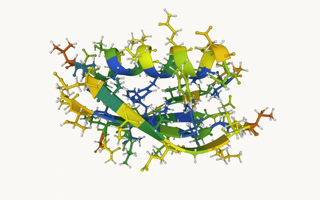
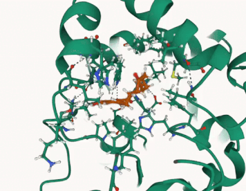

# GROMACS Copilot
**Let LLM run your MDs.**

The good news: 🎉 You now have more time to hang out with your cat! 🐱💖  
The bad news: 😢 You'll miss out on GROMACS' legendary wisdom... 🧙‍♂️💬

## Introduction  
This agent automates **MD simulations** for proteins in water using **GROMACS**. It sets up the system, runs simulations, and analyzes **RMSD, RMSF, Rg, H-bonds**, etc.  

<table>
  <tr>
    <td align="center"><b>Protein</b></td>
    <td align="center"><b>Protein-Ligand Complex</b></td>
  </tr>
  <tr>
    <td align="center">
      
    </td>
    <td align="center">
      
    </td>
  </tr>
  <tr>
    <td align="center">
      <a href="./assets/report.pdf">A demo of output report</a>
    </td>
    <td align="center">
      <a href="./assets/prot_lig_rmsf.pdf">A demo of output report</a>
    </td>
  </tr>
</table>

## How to Run  

### Before using a LLM
1. Install the package
```bash
pip install git+https://github.com/ChatMol/gromacs_copilot.git
conda install -c conda-forge acpype
```
2. Prepare a working dir and a input pdb
```bash
mkdir md_workspace && cd md_workspace
wget https://files.rcsb.org/download/1PGA.pdb
grep -v HOH 1PGA.pdb > 1pga_protein.pdb
cd ..
```

### Using DeepSeek  
```bash
gmx_copilot --workspace md_workspace/ \
--prompt "setup simulation system for 1pga_protein.pdb in the workspace" \
--api-key $DEEPSEEK_API_KEY \
--model deepseek-chat \
--url https://api.deepseek.com/chat/completions
```  

### Using OpenAI  
```bash
gmx_copilot --workspace md_workspace/ \
--prompt "setup simulation system for 1pga_protein.pdb in the workspace" \
--api-key $OPENAI_API_KEY \
--model gpt-4o \
--url https://api.openai.com/v1/chat/completions
```  

The agent handles **system setup, simulation execution, and result analysis** automatically. 🚀


## License
This project is dual-licensed under:
- **GPLv3** (Open Source License)
- **Commercial License** (For proprietary use)

For commercial licensing, [read this](COMMERCIAL_LICENSE.md).

## Known issues  
1. 🤖 LLM sometimes struggles with selecting the correct group index. Double-checking the selection is recommended.  
2. ⚡ The interaction between LLM and `gmx` prompt input isn't always seamless. Running commands based on suggestions can help you get the correct results more easily.